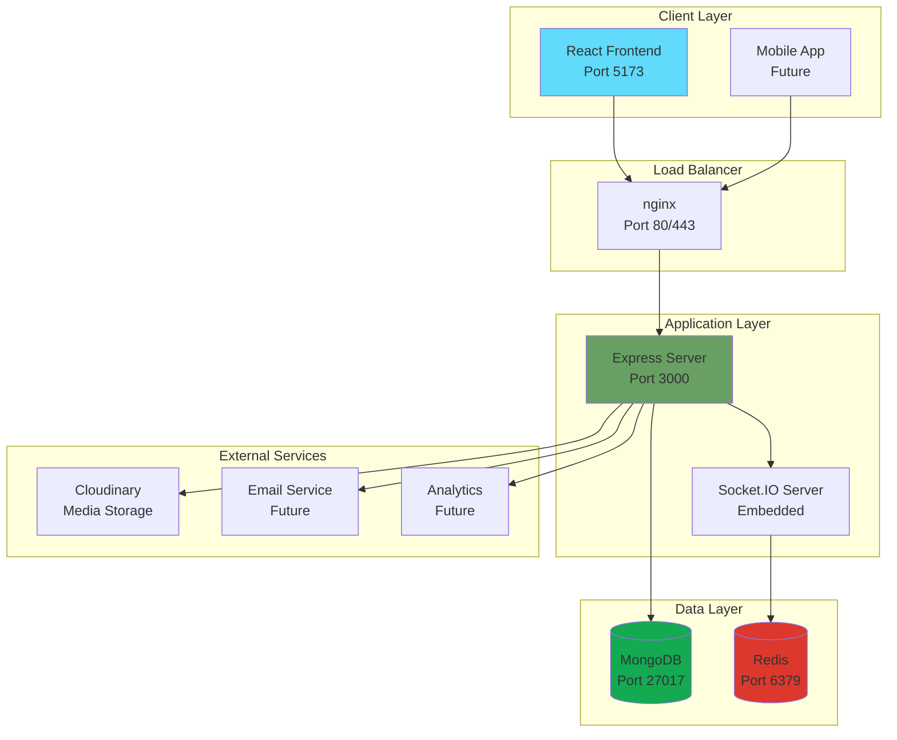
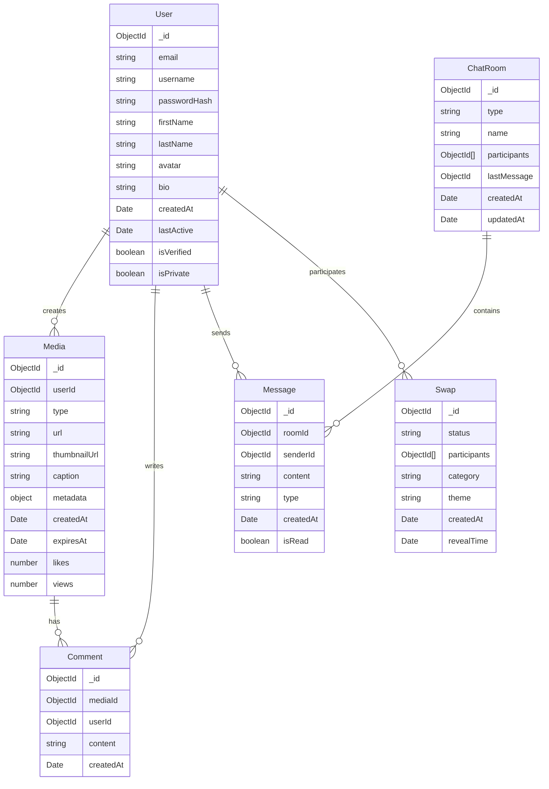
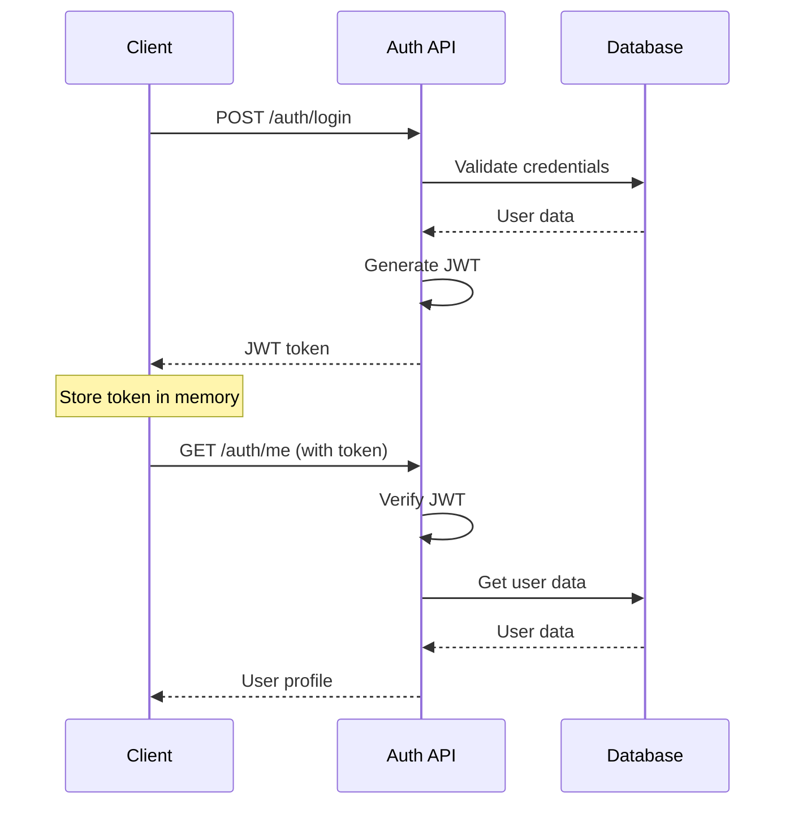
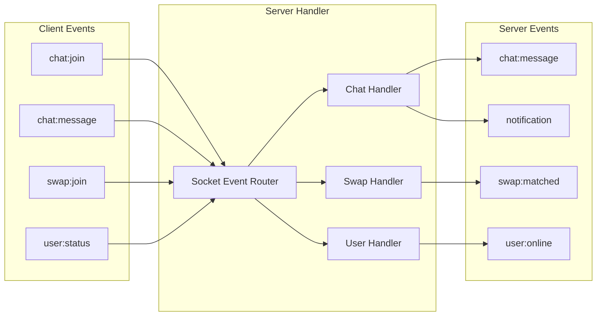
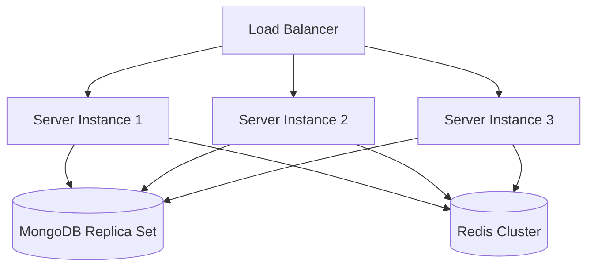

# PixSwap Architecture Documentation

## Overview

PixSwap is a modern, full-stack social media application built with a microservices-oriented architecture. The application follows separation of concerns principles with a React frontend, Node.js backend, MongoDB database, and real-time communication via Socket.IO.

## System Architecture



## Component Architecture

### Frontend Architecture (React)

```
src/
├── components/          # Reusable UI components
│   ├── ui/             # Basic UI elements (Button, Input, etc.)
│   ├── forms/          # Form components
│   ├── media/          # Media-related components
│   └── chat/           # Chat components
├── pages/              # Route-level components
├── hooks/              # Custom React hooks
├── stores/             # Zustand state management
├── services/           # API communication layer
├── utils/              # Utility functions
└── types/              # TypeScript type definitions
```

**Key Design Patterns:**
- **Component Composition**: Reusable components with clear interfaces
- **Custom Hooks**: Business logic separation from UI
- **State Management**: Zustand for global state, React state for local
- **Service Layer**: Centralized API communication

### Backend Architecture (Node.js)

```
src/
├── controllers/        # Request handlers
├── models/            # Database schemas (Mongoose)
├── routes/            # API route definitions
├── middleware/        # Custom middleware functions
├── services/          # Business logic layer
├── socket/            # Socket.IO event handlers
├── utils/             # Utility functions
└── types/             # TypeScript interfaces
```

**Key Design Patterns:**
- **MVC Pattern**: Model-View-Controller separation
- **Middleware Pipeline**: Express middleware for cross-cutting concerns
- **Service Layer**: Business logic separation from controllers
- **Repository Pattern**: Data access abstraction (via Mongoose)

## Data Architecture

### Database Schema (MongoDB)



### Data Flow Patterns

1. **Read Pattern**: Client → API → Service → Model → Database
2. **Write Pattern**: Client → API → Validation → Service → Model → Database
3. **Real-time Pattern**: Client → Socket.IO → Event Handler → Broadcast

## Security Architecture

### Authentication Flow



### Security Layers

1. **Input Validation**: Joi/Zod schemas
2. **Authentication**: JWT tokens
3. **Authorization**: Role-based access control
4. **Rate Limiting**: Express rate limit
5. **CORS**: Configured for specific origins
6. **Helmet**: Security headers
7. **Data Sanitization**: Mongoose sanitization

## Real-Time Architecture

### Socket.IO Event System



### Event Handling Patterns

- **Room-based Communication**: Users join rooms for targeted messaging
- **Namespace Separation**: Different namespaces for different features
- **Event Validation**: All events validated before processing
- **Error Handling**: Graceful error handling and client notification

## API Architecture

### RESTful Design Principles

```
GET    /api/users          # List users
GET    /api/users/:id      # Get specific user
POST   /api/users          # Create user
PUT    /api/users/:id      # Update user
DELETE /api/users/:id      # Delete user

GET    /api/media          # List media
POST   /api/media          # Upload media
GET    /api/media/:id      # Get specific media
DELETE /api/media/:id      # Delete media

POST   /api/media/:id/like # Like media (non-idempotent action)
```

### API Response Format

```typescript
// Success Response
{
  success: true,
  data: T,
  message?: string
}

// Error Response
{
  success: false,
  error: string,
  details?: any
}

// Paginated Response
{
  success: true,
  data: T[],
  pagination: {
    page: number,
    limit: number,
    total: number,
    pages: number
  }
}
```

## Deployment Architecture

### Development Environment

```yaml
services:
  mongodb:
    image: mongo:6
    ports: ["27017:27017"]
    
  redis:
    image: redis:7-alpine
    ports: ["6379:6379"]
    
  server:
    build: ./server
    ports: ["3000:3000"]
    depends_on: [mongodb, redis]
    
  client:
    build: ./client
    ports: ["5173:5173"]
```

### Production Environment

```yaml
services:
  nginx:
    image: nginx:alpine
    ports: ["80:80", "443:443"]
    
  server:
    image: ghcr.io/username/pixswap-server
    replicas: 3
    
  mongodb:
    image: mongo:6
    volumes: [mongodb_data:/data/db]
    
  redis:
    image: redis:7-alpine
    volumes: [redis_data:/data]
```

## Performance Considerations

### Optimization Strategies

1. **Database Indexing**: Strategic indexes on frequently queried fields
2. **Caching**: Redis caching for session data and frequently accessed content
3. **CDN Integration**: Cloudinary for media delivery
4. **Connection Pooling**: MongoDB connection pooling
5. **Load Balancing**: nginx for distributing requests
6. **Code Splitting**: React lazy loading for reduced bundle size

### Monitoring and Observability

- **Health Checks**: `/health` endpoints for service monitoring
- **Logging**: Structured logging with correlation IDs
- **Metrics**: Performance metrics collection
- **Error Tracking**: Centralized error reporting (future: Sentry)

## Scalability Architecture

### Horizontal Scaling



### Scaling Strategies

1. **Stateless Services**: All application state in database/cache
2. **Database Sharding**: Future horizontal database scaling
3. **Microservices**: Break down into smaller services as needed
4. **CDN**: Global content delivery network
5. **Caching Layers**: Multiple levels of caching

## Technology Decisions

### Frontend Stack Rationale

- **React**: Component-based architecture, large ecosystem
- **TypeScript**: Type safety, better developer experience
- **Vite**: Fast development builds, modern tooling
- **TailwindCSS**: Utility-first, responsive design
- **Zustand**: Lightweight state management

### Backend Stack Rationale

- **Node.js**: JavaScript everywhere, good for real-time apps
- **Express**: Mature, flexible web framework
- **MongoDB**: Document-based, flexible schema
- **Socket.IO**: Robust real-time communication
- **JWT**: Stateless authentication

### Infrastructure Rationale

- **Docker**: Consistent environments, easy deployment
- **nginx**: High-performance reverse proxy
- **GitHub Actions**: Integrated CI/CD pipeline
- **Cloudinary**: Specialized media handling

## Future Architecture Considerations

1. **Microservices Migration**: Split into specialized services
2. **Event-Driven Architecture**: Message queues for async processing
3. **GraphQL**: More efficient data fetching
4. **Mobile Apps**: React Native for mobile platforms
5. **Edge Computing**: Global edge deployment
6. **AI Integration**: Content moderation and recommendations